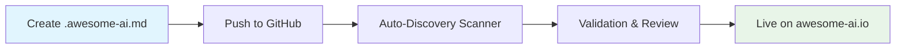
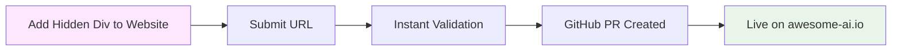

<div align="center">

#  🌟 Awesome AI

> **Automated AI tool discovery platform**


[](https://awesome-ai.io)
[](https://github.com/teodorgross/awesome-ai/stargazers)
[](https://awesome-ai.io/arena)
[](https://github.com/teodorgross/awesome-ai#-the-awesome-aimd-standard)
[](https://awesome-ai.io/submit-info)

**🚀 AI Tools • 🔄 Auto-Updated • ⚡ Real-time GitHub Scanning • 🔗 Instant URL Submission**


</div>

---

## 🌟 **What Makes Awesome AI Different?**

### **🔍Automated AI Tool Discovery**
No more manual submissions or outdated lists. Our intelligent GitHub scanner **automatically discovers** AI tools across the entire GitHub ecosystem using our revolutionary `.awesome-ai.md` standard.

### **🔗 Instant URL Submission**
Don't have a GitHub repository? No problem! Submit your AI tool instantly using our **Hidden Div Submission** system - just add a hidden div to your website and submit the URL.

### **⚡ Real-Time Updates**
When you update your tool, we know instantly. Our system tracks changes and updates your listing automatically - whether from GitHub or your website.


---

## 🚀 **Two Ways to Get Listed**

### **📋 Method 1: The `.awesome-ai.md` Standard (Recommended)**

**We've created a new industry standard for AI tool discovery!** 


#### **How It Works**


#### **Get Your Tool Listed in 3 Steps**

##### **1. 📝 Create `.awesome-ai.md` in your repository root**

```yaml
---
title: "Example AI Tool" 
category: "Chat"
description: "This is an example AI tool template for demonstration purposes"
website: "https://example.com"
icon: "https://example.com"
tags: ["example", "template", "demo", "tutorial", "placeholder"]
pricing: "Free"
github: "Important"
---

# Example AI Tool

This is an example markdown file that demonstrates how to structure AI tool descriptions for the Awesome AI platform.

INSERT YOUR TEMPLATE HERE
```

##### **2. 🔄 Push to GitHub**
Our scanner checks GitHub every 10 minutes for new `.awesome-ai.md` files.

##### **3. ✅ Get Listed Automatically**
Within hours, you'll see a Pull Request in our repository for review!

---

### **🔗 Method 2: Hidden Div Submission (Closed Source Projects)**

**Perfect for websites without GitHub repositories!**

#### **How It Works**


#### **Get Your Tool Listed in 2 Steps**

##### **1. 🏷️ Add Hidden Div to Your Website**

Add this **hidden div** anywhere on your website (preferably in the `<body>` section):

```html
<div class="awesome-ai-md" style="display: none;">
---
title: "Your AI Tool Name"
category: "Chat"
description: "Brief description of your AI tool (max 160 characters)"
website: "https://yourdomain.com"
icon: "https://yourdomain.com/icon.png"
tags: ["ai", "chat", "productivity"]
pricing: "Free"
---

# Your AI Tool Name

Detailed description of your AI tool goes here.

## Features
- Feature 1
- Feature 2
- Feature 3

## How it works
Explain how your tool works...
</div>
```

##### **2. 🚀 Submit Your URL**

[](https://awesome-ai.io/submit-info)

1. Go to [awesome-ai.io/submit-info](https://awesome-ai.io/submit-info)
2. Enter your website URL
3. Click **Submit**
4. Get instant GitHub PR creation!

#### **🔄 Automatic Updates**
- Change your hidden div content → We detect it automatically
- Updates sync within 10 minutes
- New GitHub PR created for changes

---

## 📊 **Required Fields (Both Methods)**

| Field | Description | Example |
|-------|-------------|---------|
| **title** | Your tool's name | "ChatGPT Clone" |
| **description** | Brief description (max 160 chars) | "AI chat assistant powered by GPT" |
| **website** | Your tool's website URL | "https://example.com" |
| **category** | Tool category | "Chat", "Art", "Code", "Audio", "Research", "Writing", "Video", "Agent" |
| **icon** | Tool icon URL | "https://example.com/icon.png" |
| **tags** | Array of tags (max 5) | ["ai", "chat", "gpt"] |
| **pricing** | Pricing model | "Free", "Freemium", "Paid" |

---

## 📊 **Live GitHub Leaderboards**

**See real-time GitHub statistics for AI tools on our platform!**

[](https://awesome-ai.io/arena)

- **📈 24h/7d/30d Star Growth** tracking for listed AI tools
- **🏆 Leaderboards** by stars, forks, and growth for platform tools

---


## 🌍 **For AI Tool Creators**

### **Why Choose Awesome AI?**

✅ **Multiple Submission Methods** - GitHub or website, your choice  
✅ **Instant Discovery** - Get found automatically 
✅ **Always Up-to-Date** - Changes sync automatically from both sources  
✅ **SEO Benefits** - Listed on high-authority domain    

### **Which Method Should I Choose?**

| Scenario | Recommended Method |
|----------|-------------------|
| 🏗️ **Have GitHub repository** | `.awesome-ai.md` Standard |
| 🌐 **Website only, no GitHub** | Hidden Div Submission |

---

## 🚀 **The Future is Automated**

**Traditional approach:**
- Manual submissions ❌
- Outdated information ❌  
- Spam and duplicates ❌
- Slow review process ❌

**The Awesome AI approach:**
- Automated discovery ✅
- Real-time updates ✅
- Multiple submission methods ✅

---

## ❓ **FAQ**

### **General**

**Q: Is it free?**  
A: Completely free and open-source.

### **Hidden Div Method**
**Q: Will the hidden div slow down my website?**  
A: No, it's hidden with `display: none` and has zero impact on performance.

**Q: Can I change the content later?**  
A: Yes! We monitor changes and create update PRs automatically.

**Q: What if my URL changes?**  
A: Contact us or create a new submission with the new URL.

---

## 🤝 **Contributing**

### **Found an Issue?**
- 🐛 [Report bugs](https://github.com/teodorgross/awesome-ai/issues/new?template=bug_report.md)
- 💡 [Suggest features](https://github.com/teodorgross/awesome-ai/issues/new?template=feature_request.md)

---

## 🙏 **Supporters & Sponsors**

Special thanks to:

- **🌟 All contributors** who help improve the platform
- **🤖 AI tool creators** pushing the boundaries of innovation  
- **👥 The community** for spreading the standards
- **💖 Sponsors** keeping this platform free and open-source

---

## 📄 **License & Legal**

MIT License - see [LICENSE](LICENSE) for details.

**Trademark Notice:** "Awesome AI (by Teodor Gross)", the `.awesome-ai.md` standard and features of this project are trademarks of this project. Feel free to use the standards, attribution appreciated.

---


