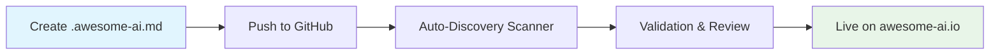

<div align="center">

#  🌟 Awesome AI

> **The world's first automated AI tool discovery platform**
> 
> Introducing the `.awesome-ai.md` standard - a revolutionary way to discover and showcase AI tools across GitHub

[](https://awesome-ai.io)
[](https://github.com/teodorgross/awesome-ai/stargazers)
[](https://awesome-ai.io/arena)
[](https://github.com/teodorgross/awesome-ai#-the-awesome-aimd-standard)

**🚀 AI Tools • 🔄 Auto-Updated • 🌍 Global Discovery on GitHub • ⚡ Real-time GitHub Scanning**


</div>

---

## 🌟 **What Makes Awesome AI Different?**

### **🔍 World's First Automated AI Tool Discovery **
No more manual submissions or outdated lists. Our intelligent GitHub scanner **automatically discovers** AI tools across the entire GitHub ecosystem using our revolutionary `.awesome-ai.md` standard.

### **⚡ Real-Time Updates**
When you update your tool, we know instantly. Our system tracks changes and updates your listing automatically.

### **🛡️ Anti-Spam & Verification**
GitHub-based discovery ensures authenticity. No fake submissions, no spam - only real projects from real developers.

---

## 🚀 **The `.awesome-ai.md` Standard**

**We've created a new industry standard for AI tool discovery!** 

Just like `.well-known/` for domains, `.awesome-ai.md` is becoming the standard way for AI tools to describe themselves.

### **How It Works**


### **Get Your Tool Listed in 3 Steps**

#### **1. 📝 Create `.awesome-ai.md` in your repository root**

```yaml
---
title: "Example AI Tool" // Required: Name of the AI tool
category: "Chat" // Required: Available Categories are Chat, Art, Code ,Writing ,Video ,Audio ,Code ,Research ,Agent
description: "This is an example AI tool template for demonstration purposes" // Required: Max 200 characters, brief description
website: "https://example.com" // Required: Official website URL
icon: "https://example.com" // Optional: PNG/JPG/SVG preferred, min 64x64px
tags: ["example", "template", "demo", "tutorial", "placeholder"] // Optional: Freely selectable, max 5 displayed
pricing: "Free" // Optional: Free/Freemium/Paid
github: "Important"
---

# Example AI Tool

This is an example markdown file that demonstrates how to structure AI tool descriptions for the Awesome AI platform.

INSERT YOUR TEMPLATE HERE

```

### Required Fields
- **title**: Your tool's name
- **description**: Brief description (max 160 chars)
- **website**: Your tool's website URL
- **github**: Your GitHub URL
- **category**: Tool category (Chat,Art, Code, Audio, Research, Writing, Video, Agent)
- **icon**: Tool icon URL
- **tags**: Array of tags (max 5)
- **pricing**: Pricing model (Free, Freemium, Paid)

#### **2. 🔄 Push to GitHub**
Our scanner checks GitHub every 10 minutes for new `.awesome-ai.md` files.

#### **3. ✅ Get Listed Automatically**
Within hours, you'll see a Pull Request in our repository for review!

---

## 📊 **Live GitHub Leaderboards**

**See real-time GitHub statistics for AI tools on our platform!**

[](https://awesome-ai.io/arena)

- **📈 24h/7d/30d Star Growth** tracking for listed AI tools
- **🏆 Leaderboards** by stars, forks, and growth for platform tools

---

## 🎯 **Categories We Cover**

<div align="center">

| 🤖 **Chat** | 🎨 **Art** | 💻 **Code** |
|:---:|:---:|:---:|
| ChatGPT, Claude, Gemini | Midjourney, DALL-E, Stable Diffusion | GitHub Copilot, Cursor, Codeium |

| ✍️ **Writing** | 🎥 **Video** | 🔊 **Audio** |
|:---:|:---:|:---:|
| Jasper, Copy.ai, Notion AI | RunwayML, Pika, Luma | ElevenLabs, Mubert, AIVA |

| 🔬 **Research** | 🤖 **Agent** |
|:---:|:---:|
| Perplexity, Claude, NotebookLM | AutoGPT, LangChain, CrewAI

</div>

---

## 🌍 **For AI Tool Creators**

### **Why Use `.awesome-ai.md`?**

✅ **Instant Discovery** - Get found automatically without manual submission  
✅ **Always Up-to-Date** - Changes sync automatically  
✅ **SEO Benefits** - Listed on high-authority domain  
✅ **Global Reach** - Reach 50,000+ monthly developers  
✅ **Future-Proof** - Industry standard growing rapidly  

---

## 🚀 **The Future is Automated**

**Traditional approach:**
- Manual submissions ❌
- Outdated information ❌  
- Spam and duplicates ❌
- Slow review process ❌

**The `.awesome-ai.md` standard:**
- Automated discovery ✅
- Real-time updates ✅
- GitHub verification ✅
- Instant processing ✅

---

## 🤝 **Contributing**

### **Found an Issue?**
- 🐛 [Report bugs](https://github.com/teodorgross/awesome-ai/issues/new?template=bug_report.md)
- 💡 [Suggest features](https://github.com/teodorgross/awesome-ai/issues/new?template=feature_request.md)


---

## 🙏 **Supporters & Sponsors**

Special thanks to:

- **🌟 All contributors** who help improve the platform
- **🤖 AI tool creators** pushing the boundaries of innovation  
- **👥 The community** for spreading the `.awesome-ai.md` standard
- **💖 Sponsors** keeping this platform free and open-source

---

## 📄 **License & Legal**

MIT License - see [LICENSE](LICENSE) for details.

**Trademark Notice:** "Awesome AI" and the `.awesome-ai.md` standard are trademarks of this project. Feel free to use the standard, attribution appreciated!

---


*"Just like how `.gitignore` became the standard for Git, `.awesome-ai.md` is becoming the standard for AI tool discovery."*

</div>
